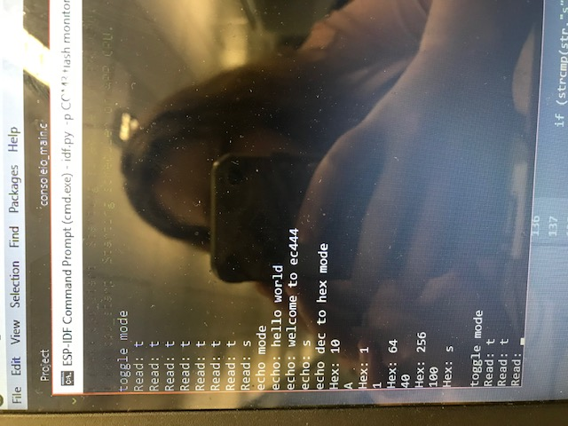

#  Skill Name

Author: Erin Dorsey, 2019-09-17

## Summary
Constructed console io module that is capable of blinking an LED, reflecting console input, and converting a decimal number to a hexidecimal. 

## Sketches and Photos

https://drive.google.com/open?id=0B9cNnya1H2c-VUJTLVp4SVB0M0xadFd0SzEwZjlkTHczNkJj

## Modules, Tools, Source Used in Solution

## Supporting Artifacts

-----

## Reminders
- Repo is private
