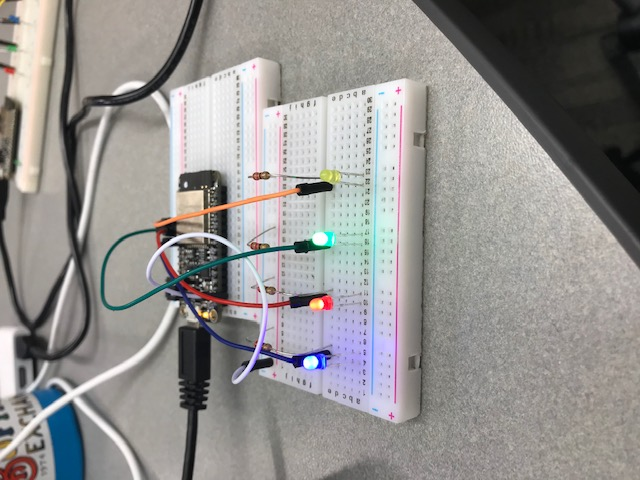

#  Skill Name

Author: Erin Dorsey, 2019-09-10

## Summary
Built a blinking LED counter that uses 4 LEDs to count 0-15 in binary

## Sketches and Photos

## Modules, Tools, Source Used in Solution

## Supporting Artifacts

-----

## Reminders
- Repo is private
