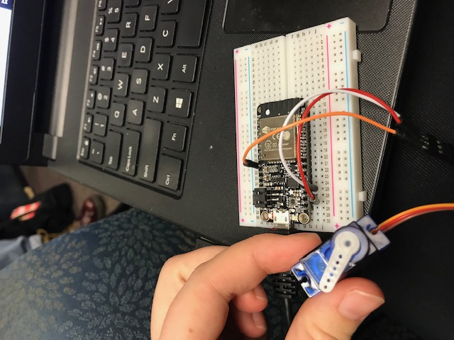

#  Skill Name

Author: Erin Dorsey, 2019-09-17

## Summary
Constructed servo module to turn both 90 and 180 degrees.

## Sketches and Photos

https://drive.google.com/file/d/0B9cNnya1H2c-TUhyMHNZX0c0NXV2aENka2F2VHVTTzlDbF9Z/view?usp=sharing
https://drive.google.com/open?id=0B9cNnya1H2c-Mk0xaHZqMkxydENBM3A2bTVvejJoZXp3RlU4

## Modules, Tools, Source Used in Solution

## Supporting Artifacts

-----

## Reminders
- Repo is private
