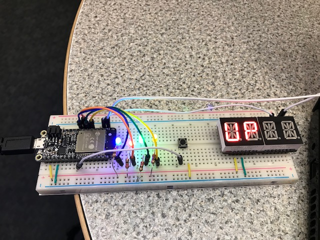
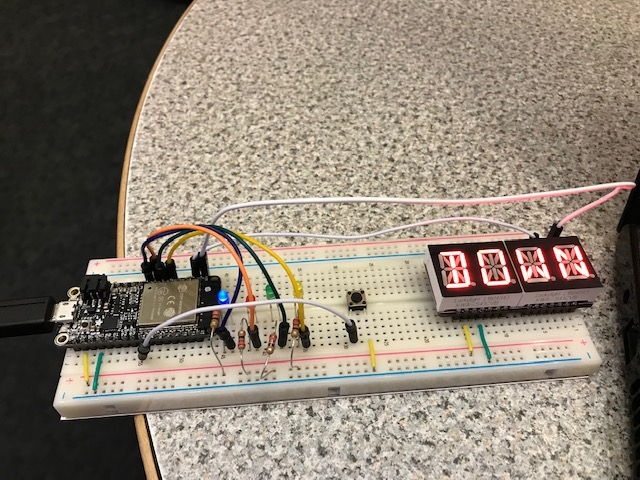

#  RTOS

Author: Erin Dorsey, 2019-09-20

## Summary
Build a module using FreeRTOS with tasks to create an LED counter that counts up or down according to a button press as well as an alphanumeric display to display the direction.

## Sketches and Photos

[Video](https://drive.google.com/open?id=1miWJg9prIwaaBURuX_z817WgSGcYtWqM)

## Modules, Tools, Source Used in Solution

## Supporting Artifacts

-----

## Reminders
- Repo is private
