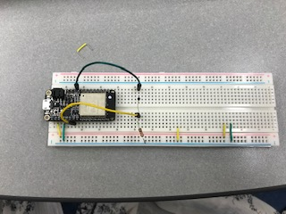

#  16 Thermistor

Author: Erin Dorsey, 2019-09-24

## Summary
Built a temperature sensor using a thermistor that printed temperature to console based on interaction with thermistor. 

## Sketches and Photos

## Modules, Tools, Source Used in Solution

## Supporting Artifacts

-----

## Reminders
- Repo is private
