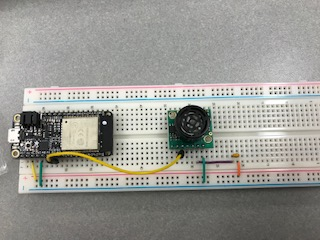

#  17 Ultrasonic

Author: FirstName LastName, YYYY-MM-DD

## Summary
Built an ultrasonic sensor that measures distance of object from sensor and displays to console. 

## Sketches and Photos

https://drive.google.com/file/d/1GaNtDBfc2uidmBLSxkYGHHY8XRST0ff2/view?usp=sharing

## Modules, Tools, Source Used in Solution

## Supporting Artifacts

-----

## Reminders
- Repo is private
