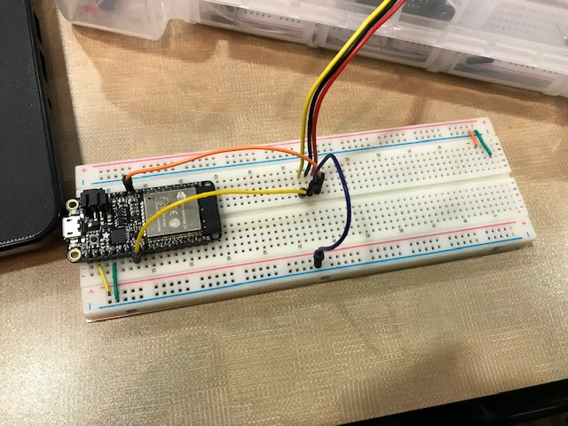

#  18 Rangefinder

Author: Erin Dorsey, 2019-09-26

## Summary
Built an IR Rangefinder module that detects the distance to an object and prints distance to console.

## Sketches and Photos

https://drive.google.com/open?id=1jKiz-UtvsJuV0nwddl-QvRZyMk4XVIBH
## Modules, Tools, Source Used in Solution

## Supporting Artifacts

-----

## Reminders
- Repo is private
