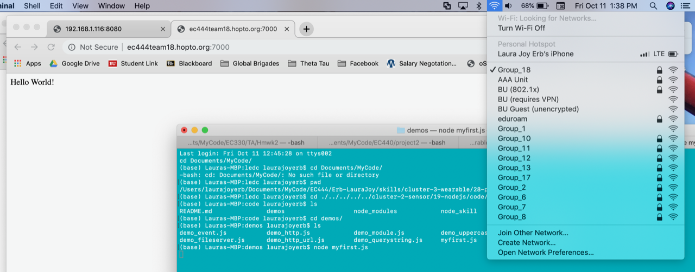

#  23 DYNDNS

Author: Erin Dorsey 2019-10-11

## Summary
Built a simple server to display hello world over the network set up by the router Group_18

## Sketches and Photos

https://drive.google.com/open?id=1j0TUN2lPJ0EolK8sdvrtYIW61oMNCDOf

## Modules, Tools, Source Used in Solution

## Supporting Artifacts

-----

## Reminders
- Repo is private
