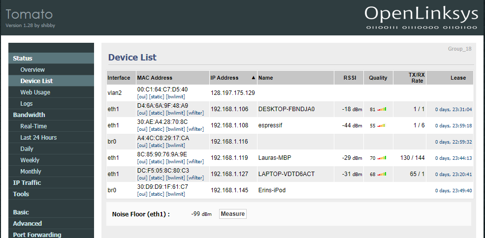

#  24 Wifi

Author: Erin Dorsey 2019-10-11

## Summary
Performed basic wifi functionality for the ESP32, demostrated connection through connected devices on router page.

## Sketches and Photos

## Modules, Tools, Source Used in Solution

## Supporting Artifacts

-----

## Reminders
- Repo is private
