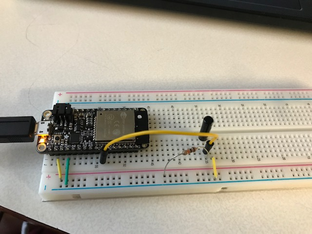

#  26 Vibration

Author: Erin Dorsey, 2019-10-17

## Summary
Built a simple vibration module that would light up the ESP32 onboard LED and print "Tap" to the console when it detects movement. Movement is induced by touching the sensor or moving the breadboard. 

## Sketches and Photos

https://drive.google.com/open?id=15RKw2ITz20i52lHkDrIa6TjJDoYPbtMH

## Modules, Tools, Source Used in Solution

## Supporting Artifacts

-----

## Reminders
- Repo is private
