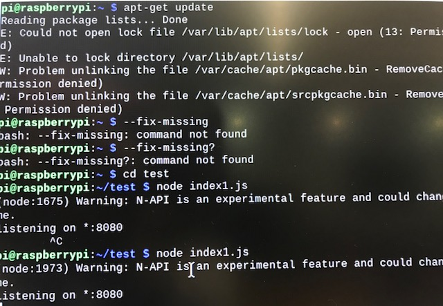

#  Persistance and Databases

Author: Erin Dorsey, 2019-11-22

## Summary
In this skill we built a module that used leveldb and an rpi to store sensor information in a database and then query that datbase to show that data in the form of a graph. 

## Sketches and Photos

## Modules, Tools, Source Used in Solution

## Supporting Artifacts

-----

## Reminders
- Repo is private
