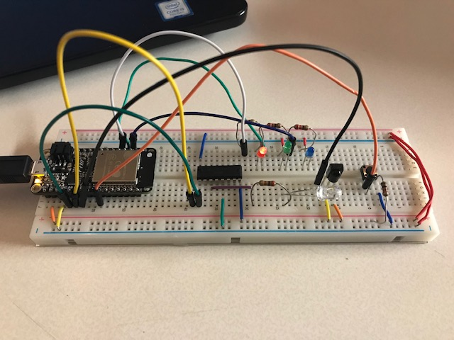

#  IR TX/RX

Author: Erin Dorsey, 2019-11-22

## Summary
In this skill we built a module that included both an IR reciever and transmitter that sends data to light up an LED.

## Sketches and Photos

## Modules, Tools, Source Used in Solution

## Supporting Artifacts

-----

## Reminders
- Repo is private
