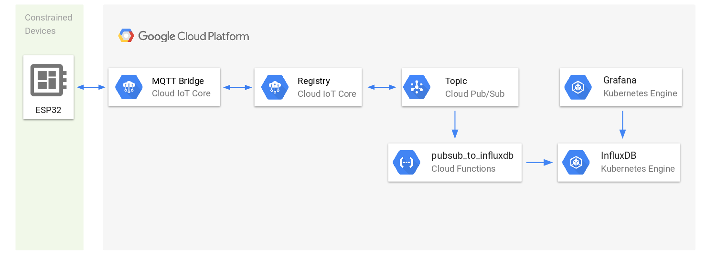

#  Security In Connected Systems

Author: Erin Dorsey, 2019-11-19

## Summary
BG stands for Bad Guy. A BG can affect the data flow, control, and physical device.

Assume a BG attacks our wearable device in quest3.

### Identify weaknesses in your node.js to ESP32 system for quest 3 (appliance) 

All our functions are open to not only the user wearing the device but also to all people accessing the website. Our user might get unwanted water alerts set by strangers.

Among all users connected to our website, we cannot identify which connection is our user. Even when the user wants to see all charts showing on the site, someone else might set a chart invisible. Thus we have no protection on user's personal information. All data is accessible to whoever connects to the website.

### What ways can a bad guy attack your specific system? List at least three

- A bad guy might set water alert every 5s on HTML
- A bad guy might set all charts invisible even when the user wants to see the data
- A bad guy might use the data for statistics without asking permission
- A bad guy might physically attack our vulnerable sensors and wires

### Describe ways that you can overcome these attacks. What ways can you mitigate these issues?

Authentication of identity is needed. Only the connection identified as the user can set chart visibility. Also, the user can add other ips as friends and family that can help him set water alerts. Only friends, family and the user can access the data. Moreover, a container is used to store the device safely.

### “IoT” provisioning is a specific challenge for connected devices. Describe how the ESP32 code base provides an IoT provisioning solution. This is the process of associating an ESP32 with a particular user and authentication in a local network.

To have user authentication, we can connect ESP32 to Google Cloud IoT Core so as to quickly and securely connect large fleets of devices directly to the Google Cloud. Cloud IoT Core is composed of two main components, a device manager and a protocol bridge:
- The device manager helps to establish the identity of a device and provides the mechanism for authenticating a device when connecting. It also maintains a logical configuration of each device and can be used to control any device from the cloud remotely.
- The protocol bridge is the way for the device to access the Google Cloud through standard protocols such as MQTT and HTTP, so one can use your existing devices with minimal firmware changes.

The data from Pub/Sub is stored in a time-series database (InfluxDB) located in a GKE cluster.

## Sketches and Photos

## Modules, Tools, Source Used in Solution
[ESP32 Arduino: Basic Authentication](https://techtutorialsx.com/2018/01/03/esp32-arduino-basic-authentication/)

[Using Cloud IoT Core to connect ESP32](http://nilhcem.com/iot/cloud-iot-core-with-the-esp32-and-arduino)

## Supporting Artifacts

-----

## Reminders
- Repo is private
