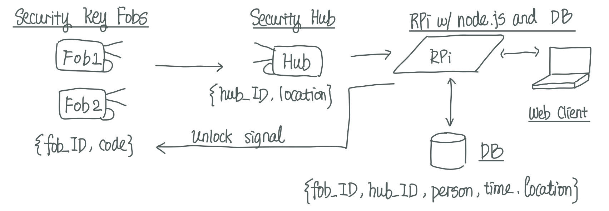
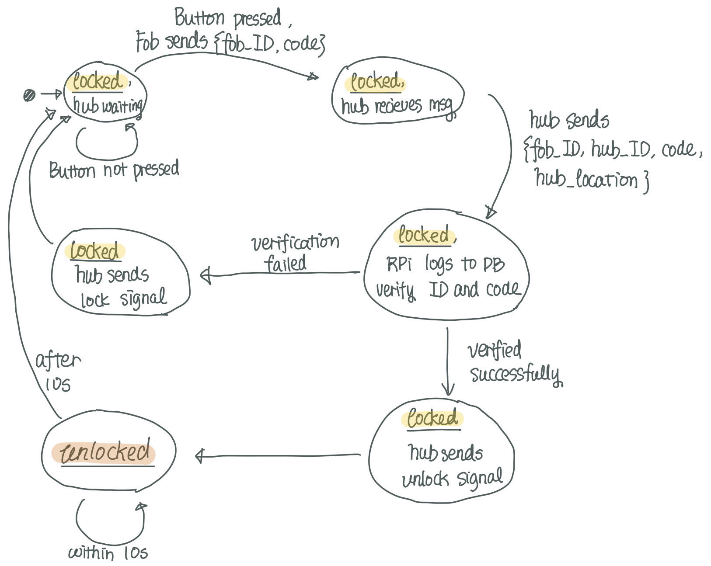
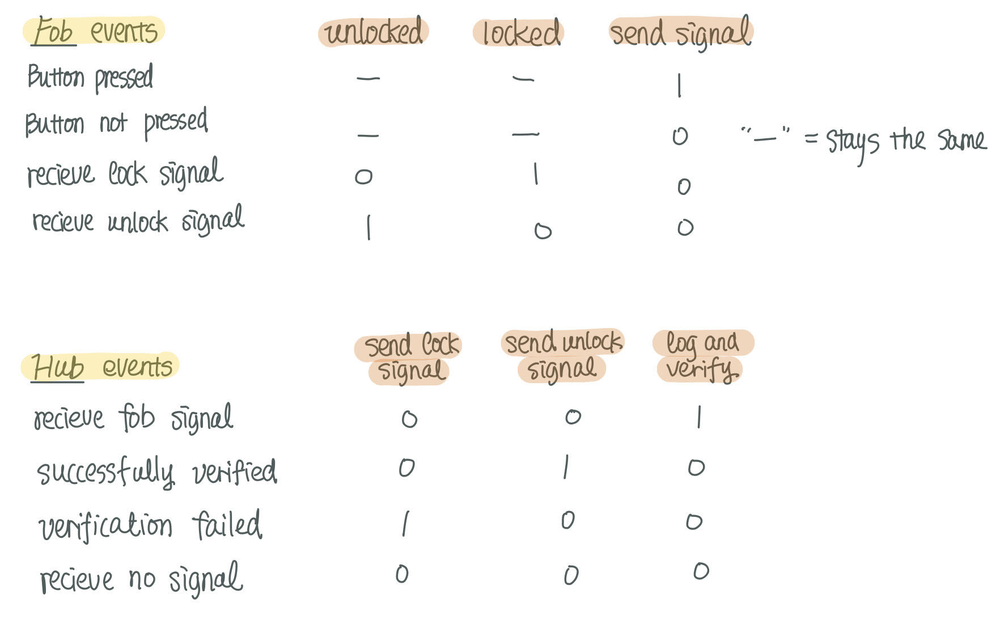

#  State Models

Author: Erin Dorsey, 2019-11-19

## Summary
In this skill, we build the state diagram and state tables for the secure key quest. 

## Sketches and Photos
### Data flow
Assume location message sent by hub. 

  

### State Diagram

  

### State Table

  

## Modules, Tools, Source Used in Solution

## Supporting Artifacts

-----

## Reminders
- Repo is private
